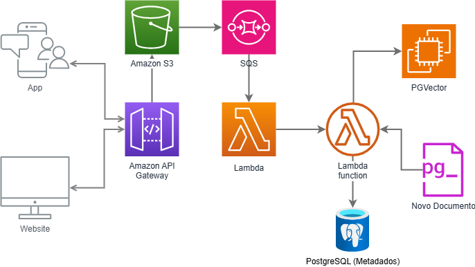

# Chatbot com Llama3 e LlamaIndex

Este projeto foi criado usando o bootstrap [`create-llama`](https://github.com/run-llama/LlamaIndexTS/tree/main/packages/create-llama) que constrói um backend e um frontend de um chatbot pronto para uso com RAG utilizando o `LlamaIndex` como framework.

## Personalização do projeto

A partir desse projeto, introduzi uma conexão com o `Llama3` rodando localmente em um container Docker como IA Generativa (LLM) padrão do projeto, o `Redis` como banco de armazenamento de cache de conversas e o `PGVector` como banco vetorial para armazenamento de embeddings e o `PostgreSQL` para armazenar metadados e feedback dos usuários.

Além disso, uma rota para receber os novos arquivos e introduzí-los no banco de dados vetorial foi criada. Essa rota é melhor descrita abaixo.

Todos os serviços e containers estão configurados no `docker-compose.yml`.

## Adição de novos documentos

O fluxo de adição de novos documentos ao banco vetorial para enriquecimento do RAG, pode ser aplicado usando soluções da AWS da seguinte forma:



1. Usuário envia o novo documento e ele é enviado via API
2. O documento é armazenado no S3 e trigga o SQS
3. O SQS cria uma novo evento e salva na fila triggando uma Lambda function
4. A lambda function puxa os metadados e armazena no PostgreSQL.
5. A lambda function envia o documento pela rota de embeddings para ser armazenado no banco vetorial.

## Rotas

Algumas rotas foram adicionadas à API do `FastAPI` com o intuito enriquecer o bot. Abaixo segue a rota e a descrição de cada uma delas. Algumas são necessárias para o funcionamento básico do chatbot, outras são para inserir os documentos no RAG e algumas aproveitam a LLM e a conexão proporcionada pelo `LlamaIndex` para gerar conteúdo via requisição.
#### 1. `/api/chat`
- **Descrição**: Rota principal para interações de chat utilizando o modelo LLM Llama3.
- **Funcionalidade**:
  - Recebe mensagens do usuário.
  - Gera respostas utilizando embeddings armazenados no pgvector.
  - Implementa um sistema de cache com Redis para armazenar conversas e melhorar a performance.

#### 2. `/api/chat/upload`
- **Descrição**: Rota dedicada ao upload de arquivos relacionados ao chat.
- **Funcionalidade**:
  - Permite que usuários enviem arquivos (ex: imagens, documentos).
  - Os arquivos podem ser processados e utilizados como contexto adicional nas interações do chat.
  - Integração com o sistema de embeddings para processar o conteúdo dos arquivos.

#### 3. `/api/s3_event`
- **Descrição**: Rota para lidar com eventos de novos documentos no S3.
- **Funcionalidade**:
  - Escuta eventos de novos documentos enviados para o Amazon S3.
  - Processa documentos e os armazena como embeddings no pgvector.
  - Atualiza o cache de conversas no Redis, se necessário.

#### 4. `/api/feedback`
- **Descrição**: Rota para coletar feedback dos usuários sobre as interações de chat.
- **Funcionalidade**:
  - Permite que os usuários enviem feedback sobre as respostas geradas pelo LLM.
  - Os feedbacks são armazenados para análise e melhoria contínua do modelo.
  - Ajuda a ajustar os parâmetros de resposta e a qualidade do serviço.

#### 5. `/api/ocr`
- **Descrição**: Rota para processamento de OCR (Reconhecimento Óptico de Caracteres).
- **Funcionalidade**:
  - Recebe imagens ou documentos e realiza OCR para extrair texto.
  - O texto extraído pode ser usado como input para o modelo LLM.
  - Integração com pgvector para armazenar e buscar embeddings do texto extraído.

#### 6. `/api/general`
- **Descrição**: Rota para prompts gerais.
- **Funcionalidade**:
  - Permite que os usuários enviem prompts ou perguntas gerais.
  - Utiliza o LLM Llama3 para gerar respostas baseadas em uma ampla gama de tópicos.
  - Respostas são cacheadas no Redis para eficiência em chamadas subsequentes.

## Containers

#### 1. `ollama`
- **Descrição**: Serviço que utiliza o modelo Ollama para processamento de linguagem natural.
- **Funcionalidade**: Gera respostas baseadas em inputs de chat e permite a configuração de origens e hosts.

#### 2. `postgres`
- **Descrição**: Banco de dados vetorial e relacional.
- **Funcionalidade**: Armazena metadados dos arquivos, feedbacks e embeddings no pgvector.

#### 3. `redis`
- **Descrição**: Armazenamento em cache Redis.
- **Funcionalidade**: Armazena dados temporários e cache de conversas para melhorar a performance do sistema.

#### 4. `backend`
- **Descrição**: Serviço principal da aplicação backend.
- **Funcionalidade**: Lida com a lógica de negócios, integra com Ollama e PostgreSQL, e expõe uma API para o frontend.

#### 5. `frontend`
- **Descrição**: Interface do usuário da aplicação.
- **Funcionalidade**: Fornece a interação do usuário com a aplicação, enviando e recebendo dados do backend.


## Rodando o projeto

Para iniciar o projeto com o docker utilize o bash script `install.sh` que utiliza o `docker-compose.yml` para subir os containers e faz a instalação da versão do Llama3 e da IA de embeddings.

```
chmod +x install.sh
sh install.sh
```

Após a finalização do processo, abra no navegador `localhost:3000` para acessar o frontend e enviar mensagens ao bot.